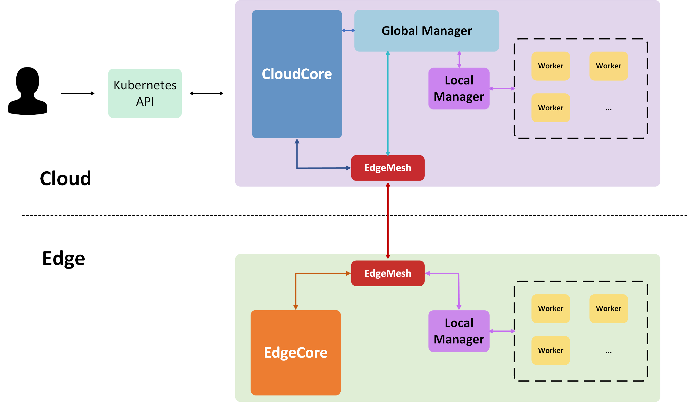

English | [简体中文](./README_zh.md)

# Dayu

## Brief Introduction

Dayu is an automated scheduling system for edge computing in stream data processing. Dayu supports dag service processing of multi data stream and focus on the scheduling policy in edge computing. It's developed based on KubeEdge and can be easily migrated.

## Related Framework
- [Docker Container](https://github.com/docker/docker-ce)
- [Kubernetes](https://github.com/kubernetes/kubernetes)
- [KubeEdge](https://github.com/kubeedge/kubeedge)
- [Sedna](https://github.com/kubeedge/sedna)
- [EdgeMesh](https://github.com/kubeedge/edgemesh)
- [TensorRT](https://github.com/NVIDIA/TensorRT)

## Architecture

Dayu is composed of five layers:

- **Basic System Layer**: This layer adopts the `KubeEdge` architecture and is deployed on all distributed nodes across the cloud-edge environment. `KubeEdge` is the `Kubernetes` extension proposed by Huawei for edge scenarios and can be well deployed on devices with limited resources and low performance.
- **Intermediate Interface Layer**: This layer is designed to offer customized service installation and component communication, through modifying and expanding official interface component `Sedna` and communication component `Edgemesh`.
- **System Support Layer**: This layer is designed to offer interactive ui (frontend), automatic installation (backend), and simulation datasource (datasource) for users.
- **Collaboration Scheduling Layer**: This layer is composed of functional components independently developed by us to complete functions such as pipeline task execution and scheduling collaboration.
- **Application Service Layer**: This layer accepts user-defined service applications. As long as the user develops service according to the interface requirements defined by the platform, it can be embedded in the platform as a container and complete execution across cloud-edge nodes.

### Basic System Layer & Intermediate Interface Layer

- Basic System Layer 
  - `KubeEdge` use CloudCore and EdgeCore to complete containerized application orchestration and device management among cloud-edge environment.
- Intermediate Interface Layer
  - `Sedna` uses Global Manager (GM) and Local Controller (LC) to implement across edge-cloud collaborative applications. According to deployment requirements of platform, we modify the CRD controller in GM and LC of `Sedna` ([link](https://github.com/dayu-autostreamer/dayu-sedna)).
  - `Edgemesh` offers an efficient way for network communication between pods in system. According to the requirements of dayu, we modify the balance policy of `Edgemesh` ([link](https://github.com/dayu-autostreamer/dayu-edgemesh)).

*NOTE: For better understanding, we transform 'Local Controller' of `Sedna` as 'Local Manager' in the structure*

### System Support Layer

It is composed of **backend**, **frontend** and **datasource**.

- `frontend`: offer a graphic user interface (as the form of web) with vue. 
- `backend`: interact with frontend to offer necessary data and install components automatically according to instructions from frontend.
- `datasource`: offer a simulated datasource which play the role of sources (e.g., cameras).

### Collaboration Scheduling Layer & Application Service Layer

Components in Collaboration Scheduling Layer and Application Service Layer work as Workers in Intermediate Interface Layer.

- `generator`: bind to a data stream and complete the segmentation of data package based on schedule policy from scheduler. 
- `controller`: control the whole process of data dealing and forwarding among cloud and edge devices.
- `processor`: process data with AI algorithms, a service pipeline may include more than one stage processor.
- `distributor`: collect data processing results and processing information from multi data stream and distribute according to different requirements.
- `scheduler`: generate schedule policy based on resource state and task state, schedule policy includes task offloading and data configuration.
- `monitor`: monitor resource usage like CPU usage, memory usage and network bandwidth.

Among these components, `generator`,`controller`,`distributor`,`scheduler` and `monitor` are embedded in the platform to offer file-grained pipeline task organization and scheduling, and they are invisible to users. The following components make up of the Collaboration Scheduling Layer. 

Meanwhile, `processor` can be equipped with user-defined application services of single-stage or multi-stage (pipeline). It makes up of Application Service Layer.

## Features
- **Make application services as stateless microservices**: User application services on the platform are all in the form of stateless microservices. Services have nothing to do with the data flow status and system status. They are automatically deployed in containers by the framework and have no node environment dependencies.
- **Compatible across heterogeneous nodes**: The platform is compatible with distributed nodes with different hardware architectures (such as x86/arm64), different performance configurations, and different resource configurations. It can adapt to different physical distances and communication quality among nodes.
- **Support fine-grained real-time scheduling**: The platform can generate task data configuration and task offloading decisions in real time based on working conditions and resource situations, thereby completing fine-grained real-time scheduling of tasks.
- **Support parallel processing of multiple data streams**: The platform supports parallel processing of multiple data streams (for example, cameras at different intersections process traffic flow tasks at the same time). These tasks do not distinguish between data streams during the processing stage and are processed equivalently.

## Guides

To get detailed instructions about our dayu system, please refer to the documentation on the [homepage](https://dayu-autostreamer.github.io/).

Please refer to our [quick start tutorial](https://dayu-autostreamer.github.io/docs/getting-started/) for a quick start of the dayu system.

If you want to further develop dayu for your needs, please refer to our [development tutorial](https://dayu-autostreamer.github.io/docs/developer-guide/).

## Contact

If you have questions, feel free to reach out to us in the following ways:

- [Lei Xie](mailto:lxie@nju.edu.cn)
- [Wenhui Zhou](mailto:whzhou@smail.nju.edu.cn)

## Contributing

If you're interested in being a contributor and want to get involved in developing the Dayu code, please see [CONTRIBUTING](CONTRIBUTING.md) for details on submitting patches and the contribution workflow.

## License
Dayu is under the Apache 2.0 license. See the [LICENSE](LICENSE) file for details.

